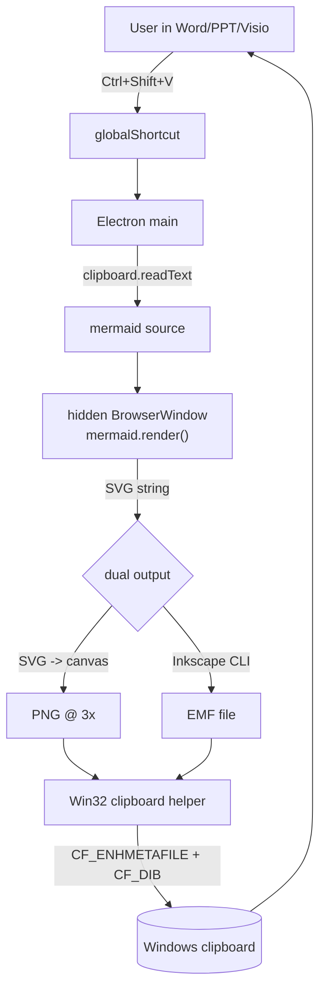

# Mermaid Clipboard Helper (Windows, Electron) — PNG + EMF, with later VSDX

## Goals

1. User copies mermaid text, switches to Word/PPT/Visio, presses a hotkey, and gets a diagram they can **ungroup and edit** inside Office.
2. Deliver this in one stage by placing EMF + PNG on the clipboard simultaneously. Office picks EMF; apps that don't speak EMF fall back to PNG.
3. Later: a native VSDX writer for users who want a proper `.vsdx` file to keep maintaining in Visio.

## Architecture (Stage 1)



## Stack

- Electron (latest stable) + TypeScript — runtime, hotkey, in-process mermaid render
- `mermaid` npm — bundled into the hidden renderer
- **Inkscape** (external dependency) — SVG -> EMF conversion. Detected at runtime; app works in PNG-only mode if missing.
- Tiny PowerShell + inline C# P/Invoke helper — sets `CF_ENHMETAFILE` (Electron's clipboard API cannot). Upgrade path: compile to a single-file .NET `SetClip.exe` for robustness.
- `electron-builder` — portable Windows .exe
- Optional `@nut-tree-fork/nut-js` for synthesizing Ctrl+V (auto-paste)

## Project layout

- `package.json`, `tsconfig.json`, `electron-builder.yml`
- `src/main.ts` — lifecycle, tray, global shortcut, orchestration
- `src/renderer/index.html` + `renderer.ts` — mermaid in a hidden BrowserWindow
- `src/preload.ts` — `contextBridge` wiring
- `src/emf.ts` — Inkscape detection + `svgToEmf(svg)` wrapper
- `src/clipboard.ts` — invokes the Win32 helper with EMF/PNG file paths
- `src/config.ts` — `%APPDATA%/mermaid-paste/config.json`
- `resources/set-clipboard.ps1` — clipboard helper (see below); later replaced by `SetClip.exe`
- `assets/tray.png`
- `README.md`

## Key implementation notes

### 1. Rendering — produces SVG and PNG in one pass

```ts
import mermaid from 'mermaid'
mermaid.initialize({ startOnLoad: false, theme: 'default' })

;(window as any).renderMermaid = async (code: string, scale = 3) => {
  const { svg } = await mermaid.render('g', code)
  const img = await loadImg('data:image/svg+xml;base64,' + btoa(unescape(encodeURIComponent(svg))))
  const c = document.createElement('canvas')
  c.width  = Math.min(8192, img.naturalWidth  * scale)
  c.height = Math.min(8192, img.naturalHeight * scale)
  const ctx = c.getContext('2d')!
  ctx.scale(c.width / img.naturalWidth, c.height / img.naturalHeight)
  ctx.drawImage(img, 0, 0)
  const blob: Blob = await new Promise(r => c.toBlob(b => r(b!), 'image/png'))
  return { svg, png: new Uint8Array(await blob.arrayBuffer()) }
}
```

### 2. SVG -> EMF — `src/emf.ts`

Inkscape 1.x, text preserved as text (critical for the ungroup-to-edit path):

```bash
inkscape in.svg \
  --export-type=emf \
  --export-filename=out.emf \
  --export-text-to-path=false
```

Detection order:
1. `MERMAID_PASTE_INKSCAPE` env var (user override)
2. `where inkscape` on PATH
3. `%ProgramFiles%\Inkscape\bin\inkscape.exe`
4. `%ProgramFiles(x86)%\Inkscape\bin\inkscape.exe`
5. Fail -> one-time tray notification, continue in PNG-only mode.

Trade-off: Inkscape is a user-installed ~150 MB dependency. Bundling portable Inkscape would bloat our installer by the same amount; we choose "detect + prompt" instead and offer a "Download Inkscape" link in the tray menu.

### 3. Setting `CF_ENHMETAFILE` — `resources/set-clipboard.ps1`

Electron's `clipboard.writeImage` only handles `CF_DIB`. For `CF_ENHMETAFILE` we need an `HENHMETAFILE` handle via Win32. Zero-build approach is PowerShell with inline C#:

```powershell
param([string]$Emf, [string]$Png)

Add-Type -TypeDefinition @"
using System;
using System.Runtime.InteropServices;
public static class Clip {
  [DllImport("user32.dll")] public static extern bool OpenClipboard(IntPtr h);
  [DllImport("user32.dll")] public static extern bool EmptyClipboard();
  [DllImport("user32.dll")] public static extern bool CloseClipboard();
  [DllImport("user32.dll")] public static extern IntPtr SetClipboardData(uint fmt, IntPtr h);
  [DllImport("gdi32.dll",  CharSet=CharSet.Unicode)]
    public static extern IntPtr GetEnhMetaFileW(string file);
}
"@

[Clip]::OpenClipboard([IntPtr]::Zero) | Out-Null
[Clip]::EmptyClipboard() | Out-Null
if ($Emf) {
  $h = [Clip]::GetEnhMetaFileW($Emf)
  # Clipboard takes ownership; do NOT DeleteEnhMetaFile.
  [Clip]::SetClipboardData(14, $h) | Out-Null   # CF_ENHMETAFILE = 14
}
# Also add CF_DIB here (same OpenClipboard session) so the transaction is atomic.
[Clip]::CloseClipboard() | Out-Null
```

Invoked from Node:

```ts
execFile('powershell', ['-NoProfile','-ExecutionPolicy','Bypass','-File', helperPath,
                        '-Emf', emfPath, '-Png', pngPath])
```

Design decision: we do **everything in the helper** (Option A) rather than racing Electron's `clipboard.writeImage` against it (Option B). Both call `EmptyClipboard`, so only one owner of the clipboard transaction is safe.

Upgrade path (Stage 1.5): replace the `.ps1` with a single-file .NET 8 AOT-compiled `SetClip.exe` (~2 MB) bundled in `resources/` to eliminate PowerShell startup (~300 ms) and execution-policy friction.

### 4. Hotkey + orchestration — `src/main.ts`

```ts
globalShortcut.register('CommandOrControl+Shift+V', async () => {
  const code = clipboard.readText().trim()
  if (!code) return
  const { svg, png } = await worker.webContents.executeJavaScript(
    `window.renderMermaid(${JSON.stringify(code)}, ${cfg.scale})`
  )
  if (!svg) return                                    // not valid mermaid -> leave clipboard alone
  const pngPath = await writeTmp(png, '.png')
  const emfPath = await svgToEmf(svg)                 // null if Inkscape missing/failed
  await setClipboard({ emf: emfPath, png: pngPath })
  if (cfg.autoPaste) await paste()                    // nut-js Ctrl+V
})
```

### 5. Tray UX

Menu: Enable/Disable, Hotkey..., Scale (2x/3x/4x), Theme (default/dark/neutral/forest), Emit EMF (on/off), Auto-paste (on/off), Inkscape path..., Quit.
Persisted to `%APPDATA%/mermaid-paste/config.json`.

## Paste behavior

- **Clipboard-only (default):** hotkey fills clipboard with EMF+PNG; user presses Ctrl+V. No focus race.
- **Auto-paste:** additionally send Ctrl+V via nut-js. Convenient but brittle across UAC-elevated windows.

Hotkey is `Ctrl+Shift+V` (configurable). Plain `Ctrl+V` is left untouched.

## Edge cases

- Invalid mermaid -> preserve original clipboard so normal paste still works.
- Inkscape missing -> PNG-only clipboard; tray notification once per session.
- Diagrams wider than 8192px -> clamp canvas; EMF is vector so unaffected.
- Dark slide themes -> `theme: 'dark'` in config.
- Inkscape EMF text-preservation quirks on exotic fonts -> documented in README; workaround is `--export-text-to-path=true` via tray toggle.

## Stage 2 — Custom VSDX exporter

draw.io has removed VSDX export due to quality issues, so we roll our own, scoped tightly and referencing the historical draw.io implementation as a spec.

- Reference: last `jgraph/drawio` commit containing `src/main/webapp/js/diagramly/vsdx/VsdxExport.js` and siblings.
- Standards: MS-VSDX (OPC package), ECMA-376 OPC basics.

**Scope v1 — flowchart-family only** (`graph`, `flowchart`, `classDiagram`, `stateDiagram`):

1. Render mermaid normally to get its SVG (dagre layout already computed).
2. Parse the SVG to extract per node: id, cx/cy, w/h, label text, shape archetype (rect / rhombus / ellipse / stadium).
3. Per edge: source id, target id, path waypoints, arrowhead type, label.
4. Emit a `.vsdx` ZIP with:
   - `[Content_Types].xml`
   - `_rels/.rels`, `visio/_rels/document.xml.rels`, `visio/pages/_rels/page1.xml.rels`
   - `visio/document.xml` — page size, units
   - `visio/pages/pages.xml`, `visio/pages/page1.xml` — `<Shape>` per node, `<Connect>` for edges referencing shape IDs so Visio re-routes connectors on move
   - `visio/masters/masters.xml` + `masterN.xml` for the 4–5 shape archetypes we use
5. Exposed as tray action "Save as .vsdx..." -> file dialog. Not a clipboard paste (VSDX isn't a clipboard-native format).

Out of scope v1 (fallback: wrap the EMF in a single-shape VSDX with no editability win): sequence, gantt, pie, sankey, mindmap, git, timeline, quadrant, journey.

Tools: `jszip` for packaging, `fast-xml-parser` for reading the mermaid SVG, hand-authored XML templates.

## Dev workflow

- Devcontainer (Linux) for typecheck and rendering-logic unit tests (mermaid runs fine in Electron-for-Linux too).
- Windows host for hotkey/clipboard/EMF testing: `npm run dev` launches Electron; `npm run dist` produces a portable `.exe`.
- Inkscape must be installed on the dev Windows host for EMF tests; the CI Linux job skips EMF tests.
