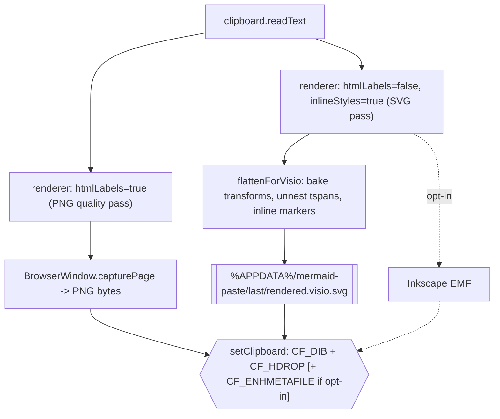

## Clipboard layout going forward

One pipeline invocation produces three outputs that are all placed on the clipboard in a single atomic open/empty/close:

- **CF_DIB** — PNG. Consumed by Word/PowerPoint on plain paste. Unchanged.
- **CF_HDROP** — path to `rendered.visio.svg` on disk. Consumed by Visio/Inkscape/browsers on paste (they see it as a "file copied from Explorer"). New.
- **CF_ENHMETAFILE** — EMF. Only produced when `emitEmf` is true AND Inkscape is available. Default flips to false; checkbox relabelled to reflect that it's experimental and often produces non-editable glyph paths.

Rationale: the user verified that Visio consumes CF_HDROP of an SVG file. Inkscape's EMF writer has been the source of every text-related bug this session; keeping it opt-in respects the "keep_optional" choice without blocking anyone who wants it.




## Diagnosis: why Visio shifts text to the bottom today

Observation from `绘图1.png`: every text label's **X** is correct (labels line up with their edge positions horizontally) but every text label's **Y** is collapsed to the bottom of the page, *only* for `<text>` elements. The sibling `<rect class="background">` inside the same `<g>` lands correctly. Relevant structure in `rendered.plaintext.svg`:

```xml
<g class="edgeLabel" transform="translate(158.5, 98.5)">
  <g class="label" transform="translate(-0.3, -10.5)">
    <g>
      <rect class="background" x="-45.1" y="-1" .../>                <!-- ✓ positioned -->
      <text y="-10.1" text-anchor="middle">                           <!-- ✗ dumped -->
        <tspan x="0" y="-0.1em" dy="1.1em">
          <tspan alignment-baseline="central" dominant-baseline="central">Ctrl+Shift+V</tspan>
        </tspan>
      </text>
    </g>
  </g>
</g>
```

Each `<text>` baseline depends on **five** composed vertical signals: outer `<g>` translate, inner `<g>` translate, own `y`, em-relative `dy` on the outer `<tspan>`, and `dominant-baseline="central"` on the inner `<tspan>`. Two independent pathologies in Visio's SVG importer compound here:

- Visio applies ancestor `<g transform>` to geometry nodes (that's why the `<rect>` is placed correctly) but sends `<text>` through a *separate* text-layout pipe that doesn't inherit the same CTM chain. So the outer two translates are effectively lost for `<text>` only.
- Em-relative `dy` combined with `dominant-baseline="central"` is an edge case Visio can't resolve; when the layout engine fails, it falls back to a page-flow "text block" placement, emitting the strings one after another below the drawing. That matches the observed ordering: the labels appear in the same top-to-bottom sequence as the edges they label.

Each of the three flattening steps below targets one of these failure modes:

- **Step 1** writes the composed Y translate directly onto the `<text>`, so Visio never has to inherit it through `<g>`s.
- **Step 2** removes em units, `dy`, and `dominant-baseline`, leaving a plain `<text x="abs" y="abs">Label</text>` that Visio's text pipe handles reliably.

- **Step 3** is orthogonal to the shift but fixes the adjacent "arrowheads vanish on ungroup" failure.

## Visio-friendliness pass

New function `flattenForVisio(svg)` in [src/renderer/renderer.ts](src/renderer/renderer.ts), run immediately after the existing `inlineComputedStyles()` during the EMF/plaintext pass. Because it runs inside the renderer it has a live SVG DOM with `getCTM()`, `getBBox()`, etc.

Steps, in order:

1. **Bake nested `<g transform>`s into leaves.** Walk every `<text>/<rect>/<path>/<circle>/<ellipse>/<line>/<polygon>/<polyline>`. Read `element.getCTM()` relative to the `<svg>` root, compose with any existing `transform` on the element itself, hoist the element to be a direct child of the root `<svg>` (or a single top-level `<g>`), and write back a single `transform="matrix(a,b,c,d,e,f)"` on it. Then delete every now-empty `<g>`. This collapses the 37 nested groups into a flat structure.
2. **Collapse nested `<tspan>`s.** For each `<text>`: descend, gather the concatenated text nodes into a single string, drop the nested `<tspan class="text-outer-tspan"><tspan class="text-inner-tspan">…</tspan></tspan>` structure, replace with either `<text ...>Label</text>` (single-line) or `<text ...><tspan x="…" dy="…">line1</tspan><tspan x="…" dy="1.2em">line2</tspan></text>` (multi-line). Strip `alignment-baseline`/`dominant-baseline` and em-relative `dy` — convert to absolute `y` on the `<text>` using `getBBox()`. This is exactly the brittle area Visio's importer mishandles today (the "text dumped at the bottom" symptom).
3. **Inline arrow markers.** For each `<path>` carrying `marker-end="url(#arrowhead-…)"`: resolve the referenced `<marker>` from `<defs>`, compute the arrow's tip position from the path's last segment end point and its tangent angle at that point (`path.getPointAtLength(path.getTotalLength())` + a small backstep for tangent), emit an explicit `<polygon points="…" fill="…" stroke="…"/>` at the correct position/rotation, and remove the `marker-end` attribute. After all edges are processed, delete the `<marker>` defs. This keeps arrowheads visible after Visio ungroup, which today sometimes drops them.
4. **Serialize** the flattened SVG with `XMLSerializer` and return.

The output SVG has no nested transforms, single-level text, no markers, no foreignObjects, no `<style>`, and all styles inline — which collectively is as close to "just shapes and text" as we can get without rewriting as Visio VDX.

## Code changes

- [src/renderer/renderer.ts](src/renderer/renderer.ts): add `flattenForVisio(svg: string): string`; extend `RenderInput` with `flattenForVisio?: boolean`; when set, call it after `inlineComputedStyles`. About 150 lines; isolated.
- [src/main.ts](src/main.ts): in `runPipeline`, call the plain-text renderer with `{ htmlLabels: false, skipDomInject: true, inlineStyles: true, flattenForVisio: true }` once (drops one of the current two passes when EMF is off). Write result to `rendered.visio.svg` inside `lastRenderDir()`. Pass that path into `setClipboard`. Existing "rendered.plaintext.svg" artefact stays for debugging when EMF is enabled.
- [src/clipboard.ts](src/clipboard.ts): `setClipboard` gains an optional `svgFilePath?: string`; passed through to the helper.
- [resources/set-clipboard.ps1](resources/set-clipboard.ps1): add a `-SvgPath` parameter; when supplied, register CF_HDROP carrying that single file path. All three formats (CF_DIB, CF_HDROP, CF_ENHMETAFILE) get set in one `OpenClipboard`/`EmptyClipboard`/`SetClipboardData`/`CloseClipboard` sequence so apps that look for the "best" format win deterministically.
- [src/config.ts](src/config.ts): flip `emitEmf` default from `true` to `false`.
- [src/main.ts](src/main.ts) tray menu: relabel "Emit EMF (editable vector in Office)" to "Emit EMF (opt-in; text often non-editable)". Add a "Open last render folder" menu item if not already present (it is) and keep it where people can reach it.
- [src/types.ts](src/types.ts): `RenderInput` type update for the new flag.

No new dependencies. No change to the PowerShell-as-clipboard-helper strategy; we just add one more `CF_`* format to what it already writes.

## Out of scope for this plan

- Rewriting as Visio VDX/VSDX (that's still the Stage-2 plan item).
- Changing hotkey behavior, autoflip logic, or the tray's other toggles.
- Bundled font embedding — no longer relevant since we're not fighting Inkscape text anymore.

## Manual test checklist we'll run afterwards

- Paste into Word: PNG appears (unchanged).
- Paste into PowerPoint: PNG appears (unchanged).
- Paste into Visio: SVG file lands; Insert > Paste shows the diagram; ungroup reveals Visio-native shapes with text intact.
- Inspect `rendered.visio.svg`: no nested `<g transform>`, no nested `<tspan>`, no `<marker>`, no `<foreignObject>`.
- With "Emit EMF" toggled on, EMF still goes on the clipboard (regression check for the opt-in path).

