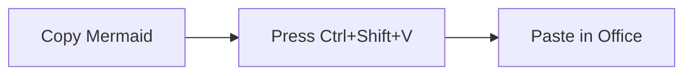

# Mermaid Paste

Turn Mermaid text into paste-ready diagrams for Office apps.

`Mermaid Paste` is a Windows-focused Electron tray app:

1. Copy Mermaid source text.
2. Press a global hotkey (default `Ctrl+Shift+V`).
3. Paste in Word / PowerPoint / Visio.

The app writes multiple clipboard formats atomically so each target app picks
the best one available:

- `CF_DIB` (PNG) for universal paste support.
- `CF_HDROP` + `image/svg+xml` for Visio-friendly SVG file paste.
- Optional `CF_ENHMETAFILE` (EMF via Inkscape), opt-in.

## Release status (v0.1.0)

This README is aligned with:

- `[.cursor/plans/mermaid_clipboard_paster_bd4776ac.plan.md](./.cursor/plans/mermaid_clipboard_paster_bd4776ac.plan.md)`
- `[.cursor/plans/visio-friendly_svg_pipeline_2ac179ca.plan.md](./.cursor/plans/visio-friendly_svg_pipeline_2ac179ca.plan.md)`
- `transcipt.md` implementation log

### Accomplished

- Stage 1 app is built: tray app, hotkey, hidden renderer, clipboard pipeline.
- Visio-friendly SVG pipeline shipped and enabled by default.
- EMF export remains available as an opt-in path.
- Portable Windows build output is wired with `electron-builder`.
- Debug workflow added: logs plus persisted last-render artifacts.

### Remaining

- Native `.vsdx` writer (Stage 2) is not implemented yet.
- Coverage is strongest for flowchart-family diagrams; exotic Mermaid types
are not yet tuned for Visio-native editing.

## How to use

### End-user quick start (Windows)

1. Launch `Mermaid Paste`.
2. Copy Mermaid text, for example:




1. Switch to Word, PowerPoint, or Visio.
2. Press `Ctrl+Shift+V`.
3. Paste (`Ctrl+V`) if Auto-paste is off.

### What each app usually receives

- Word / PowerPoint: PNG (`CF_DIB`) by default, EMF when enabled and accepted.
- Visio: SVG file drop (`CF_HDROP`) from `mermaid.svg` for better editability.
- Other apps: PNG fallback.

### Tray options that matter most

- Enable/Disable app and hotkey.
- Scale (`2x`, `3x`, `4x`) for PNG quality.
- Mermaid theme (`default`, `dark`, `neutral`, `forest`).
- Emit Visio-friendly SVG (default on).
- Emit EMF via Inkscape (default off, opt-in).
- Plain SVG text for EMF (`htmlLabels: false`) to prevent missing text.
- Convert text to paths (EMF fallback for problematic fonts).
- Auto-flip LR<->TB when diagram is too wide.
- Auto-paste via `@nut-tree-fork/nut-js` (optional dependency).
- Inkscape path setup and re-detection.
- Debug submenu (open logs, config folder, and last render folder).

Config persists to `%APPDATA%/mermaid-paste/config.json`.

## Installation and development

### Requirements

- Runtime target: Windows 10/11 (global hotkey + advanced clipboard formats).
- Dev: Node.js 20+ and npm.
- Optional: Inkscape 1.x for EMF export.

Inkscape detection order:

1. Tray-configured path in config.
2. `MERMAID_PASTE_INKSCAPE` environment variable.
3. `where inkscape` (Windows PATH).
4. `C:/Program Files/Inkscape/bin/inkscape.exe`.
5. `C:/Program Files (x86)/Inkscape/bin/inkscape.exe`.

### Run in dev mode

```bash
npm install
npm run build
npm start
```

Helpful scripts:

- `npm run dev` - start Electron with inspector.
- `npm run typecheck` - TypeScript checks.
- `npm run dist` - portable Windows build.
- `npm run dist:cached` - build via local `electron-cache` mirror.

### Build portable exe

```bash
npm run dist
```

Output:

- `release/Mermaid Paste-<version>-portable.exe`

### Linux devcontainer cross-build notes

Cross-building to Windows works via `wine`, but initial dependency downloads can
be flaky. If needed, pre-seed `electron-cache/` and use:

```bash
npm run dist:cached
```

One-time Debian/Ubuntu prerequisites:

```bash
sudo dpkg --add-architecture i386
sudo apt-get update
sudo apt-get install -y --no-install-recommends wine wine32 wine64
```

## Architecture overview

1. Main process reads clipboard text on hotkey.
2. Hidden renderer runs Mermaid and returns normalized SVG + dimensions.
3. PNG is captured via `webContents.capturePage`.
4. Optional Visio pass flattens SVG for import reliability.
5. Optional EMF pass converts SVG with Inkscape.
6. PowerShell helper writes all clipboard formats in one transaction.

Primary files:

- `src/main.ts` - orchestration, tray UI, hotkey, pipeline.
- `src/renderer/renderer.ts` - Mermaid rendering + SVG normalization/flattening.
- `src/clipboard.ts` - Windows clipboard helper bridge.
- `resources/set-clipboard.ps1` - Win32 clipboard format writer.
- `src/emf.ts` - Inkscape detection and SVG->EMF conversion.
- `src/config.ts` and `src/types.ts` - persistent settings and contracts.

## Known issues and limitations

- EMF is still inconsistent across Office/Visio combinations; it is opt-in for
this reason.
- Visio import quality is much better after flattening, but some very complex
diagrams may still need manual cleanup.
- Auto-paste can fail in elevated/UAC contexts due to input injection limits.
- If another app already owns the hotkey, registration fails until changed.
- Non-flowchart Mermaid diagram types are not yet a first-class target for
Visio editing.
- Stage 2 native `.vsdx` export is planned, not shipped.

## Troubleshooting

- Hotkey does nothing: ensure clipboard currently contains plain Mermaid text.
- "Could not register hotkey": choose another shortcut from tray menu.
- Missing EMF output: verify Inkscape path and keep EMF enabled.
- Missing EMF text: keep "Plain SVG text for EMF" enabled.
- Bad paste output: use Debug -> Open last render folder and inspect:
`input.mmd`, `rendered.svg`, `rendered.visio.svg`, `rendered.png`, `rendered.emf`.
- Logs are in `%APPDATA%/mermaid-paste/logs/main.log`.

## Roadmap

- Stage 2: native `.vsdx` export for flowchart-family diagrams.
- Expand diagram-type support and cross-app paste reliability tests.

